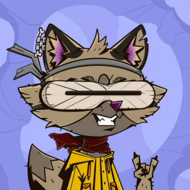

# LUMINARIX
## Created by 🜃🜆🜆🜐🜎🜎 (Bu E E O Mo Mo)

🜂 🜎🜅🜖🜇🜆 🜐🜎 🜅🜆🜎 🜇🜆🜏🜅🜆🜎 🜃🜖 🜂 🜅🜆  
(translation ~ A language for foxiz created by a fox 🦊.)

## Dec 17th 2023 Version 1.0

# Intro
In the ethereal realm of "World of Rogues," a game of cunning and shadows, the essence of its allure lies not just in the gameplay but in the very tongues its characters speak. Here, in this fantastical domain, the characters are not mere mortals but foxiz, creatures of myth and trickery, each endowed with a sly intelligence and a beguiling charm. This world is not merely a place to play; it is a realm where the art of language is as crucial as the stealthy steps of its vulpine inhabitants.

To enhance this immersive experience, a language has been crafted, a tongue unique to these sly beings, a dialect that resonates with the cleverness and guile intrinsic to their nature. This language is more than mere words; it is a symphony of expression, a dance of syllables that weaves the players deeper into the game's intricate tapestry. As players engage, they do not simply speak; they embody the very essence of these cunning foxiz, their words a reflection of the artful deceit and playful intrigue that defines the game.

Thus, "World of Rogues" transcends the boundaries of ordinary gaming, elevating itself to an experience that is both intellectually stimulating and viscerally engaging. As players navigate this world, their tongues become tools of their trade, their language a weapon as sharp as any blade. In this game, to speak is to delve deeper into the heart of cunning, to become one with the foxiz that roam its enigmatic landscape.

Inspired by World of Rogues, I created the beginning of a language called *Luminarix* (still a work in progress). This name combines a sense of luminance or light (Lumin-) with a touch of mystery and sophistication (-arix), suggesting a language that is both enlightening and enchanting, befitting the clever and mystical nature of foxiz.  

# World of Rogues (Season 2 - Starts Dec 18th, 2023)
Don't just play games, live them in the World of Rogues. Check it out [HERE](https://www.rogues.studio)  
More info about the game & gameplay [HERE](https://docs.rogues.studio/rogues-studio/values-and-mission)

# Alphabet

|Luminarix Characters | sounds like|  
|--------------------|------------|
|🜂                   |"a" in apple|   
|🜃                   |"bu" in bun|     
|🜄                   |"ci" in cinema|  
|🜅                   |"de" in den|     
|🜆                   |"e" in end|      
|🜇                   |"fi" in fin|
|🜈|"gi" in gift|
|🜉|"hi" in hit|
|🜊|"i" in it|
|🜋|"ju" in jump|
|🜌|"ki" in kit|
|🜍|"lu" in luck|
|🜎|"mo" in mop|
|🜏|"nu" in nut|
|🜐|"o" in on|
 |🜑|"pi" in pin|
 |🜒|"ki" in kinectic|
 |🜓|"ru" in ruck|
 |🜔|"si" in sit|
 |🜕|"ti" in tin|
 |🜖|"u" in cup|
 |🜗|"v" in victory|
 |🜘|"wi" in win|
 |🜙|"zi" in zebra|
 |🜚|"yu" in yuck|
 |🜛|"zi" in zinc|

 ## Common Words & Phrases
 |Luminarix Chars |Pronunciation|Meaning|
 |------------|-------------|-------|
 |🜂🜆	|AE|I/Me|
 |🜎🜅|Mo|See|
 |🜅🜆|De|Fox|
 |🜕🜎|To|Tree|
 |🜎🜅🜉|Mo Di|Run|
 |🜆🜐|EO|Eat|

 |Luminarix Chars |Pronunciation|Meaning|
 |------------|-------------|-------|
 |🜄🜎|Ci Mo|Yes|
 |🜎🜃|Mo Bu|No|
 |🜎🜆🜎🜎🜅|Mo E Mo Mo De|Hello(formal)|
 |🜆🜎|E Mo|Hello(casual)|
 |🜎🜅🜑|Mo Di Pi|Good|
 |🜃🜎🜉|Bu Mo Hi|Bad|
 |🜇🜆 🜎🜅🜎🜉🜆🜇|Fi E Mo Di Mo Hi E Fi|Good Morning|
 |🜑🜆🜗🜆 🜂 🜎🜅🜑 🜏🜉🜖|Pi-E-Vi-E A Mo-De-Pi Nu-Hi-U|Have a good day|

  |Luminarix Chars |Pronunciation|Meaning|
 |------------|-------------|-------|
 |🜙🜅🜎🜖🜃(🜎)|Xi De Mo U Bu(Mo)|World(s)|
 |🜑🜆|Pi E|Of|
 |🜓🜐🜇🜖🜆(🜎)|Ru O Fi U E	(Mo)|Rogue(s)|
 |🜕🜉🜆|Ti Hi E|The|
 |🜕🜐|Ti O|To|
 |🜎🜅🜒🜆|Mo De Qi E|Rock|
 |🜆🜇🜆🜉|E Fi E Hi|Fish|

  |Luminarix Chars |Pronunciation|Meaning|
 |------------|-------------|-------|
 |🜈🜎🜎🜆🜅🜐|Gi E Mo Mo E De O|Hallelujah|
 |🜈🜎🜐🜆|Gi Mo O E|Grateful|
 |🜇🜐🜆🜏🜇|Fi O E Nu Fi|Going|
 |🜐🜆🜕|O E Ti|PET|
 |🜇🜐🜅🜆🜎🜆|Fi O De E Mo E|Goodbye(formal)|
 |🜃🜖🜆|Bu U E|Bye(casual)|
 |🜎🜅🜈🜐🜓|Mo De Gi O Ru|Word used to chant during celebrations!|

 # Vulp Idioms in Luminarix & Meanings
  |Luminarix Chars |Pronunciation|Meaning|
 |------------|-------------|-------|
 |🜓🜆🜐🜒 🜎🜆🜕 🜓🜆🜎🜆🜃, 🜓🜕🜆🜒🜑🜆 🜎🜆🜕 🜅🜆|Ru-E-O-Qi Mo-E-Ti Ru-E-Mo-E-Bu, Ru-Ti-E-Qi-Pi-E Mo-E-Ti De-E|Sneak like a shadow, strike like a fox|
 |🜂 🜅🜆🜎 🜓🜆🜎🜐🜎 🜆🜓 🜆🜏 🜔🜆 🜕🜆🜎🜎|A De-E-Mo Ru-E-Mo-O-Mo E-Ru E-Nu Si-E Ti-E-Mo-Mo|A fox's wisdom is in its tail|
 |🜆🜗🜆🜏 🜂 🜅🜆 🜇🜆🜏 🜃🜆 🜐🜅🜆🜎-🜅🜆|E-Vi-E-Nu A De-E Fi-E-Nu Bu-E O-De-E-Mo-De-E|Even a fox can be outfoxed|
 

 # Common Vulp Names & Meanings in Luminarix
 |Vulp Names|Pronunciation|Meaning|
 |----------|-------------|-------|
 |🜇🜆🜎|Fi E Mo|Swift Fox|
 |🜐🜓🜆|O Ru E|Wise One|
 |🜎🜔🜆|Mo Si E|Moonlight🌕|
 |🜉🜆🜖|Hi E U|Morning Dew|
 |🜍🜆🜎🜎|Lu E Mo Mo|Forest Whisper|
 |🜗🜅🜖|Vi De U|Valiant Heart❤️|
 |🜆🜐🜕|E O Ti|Echo Of Nature|
 |🜇🜉🜗|Fi Hi Vi|Winter's Breeze|
 |🜐🜎🜊|O Mo I|Star Gazer|
 |🜕🜔🜗🜆|Ti Si Vi E|Silent River|
 |🜃🜎🜆🜎🜎🜆🜎|Bu Mo E Mo Mo E Mo|Dreamer|
 |🜆🜏🜖🜎|E Nu U Mo|Small One|
 |🜉🜆🜐🜓🜆|Hi E O Ru E|Dancing Flame|
 |🜓🜖🜔🜇🜖🜒|Ru U Si Fi U Qi|Troublemaker😈|
 |🜇🜆🜅🜐🜎|Fi E De O Mo|Forest Guardian|
 |🜅🜆🜎🜗🜆🜎|De E Mo Vi E Mo|Thief|
 |🜈🜆🜎🜏🜖|Gi E Mo Nu U|Echo of the Valley|
 |🜎🜆🜐🜅🜆🜎🜖|Mo E O De E Mo U|Gift to the World|
 |🜓🜎🜆🜎🜑🜆|Ru Mo E Mo Pi E|Great Swimmer|
 |🜈🜆🜎🜕🜆🜎|Gi E Mo Ti E Mo|Echo of the Forest|
 |🜏🜖🜎🜍🜆|Nu U Mo Lu E|Dark One|
 |🜇🜉🜎🜕🜆|Fi Hi Mo Ti E|Ghost👻|
 |🜎🜅🜖🜏🜆🜍🜕|Mo Di U Nu E Lu Ti|Midnight|
 |🜎🜅🜃|Mo Di Bu|Red|
 |🜉🜆🜎🜇🜆|Hi E Mo Fi E|Hungry|

 # Numbers
 |Luminarix Chars |Pronunciation|Meaning|
 |------------|-------------|-------|
 |🜂🜐|Ao|1|
 |🜃🜖|Bu U|2|
 |🜄🜏|Ci Nu|3|
 |🜅🜘|De Wi|4|
 |🜆🜑|E Pi|5|
 |🜇🜚|Fi Yu|6|
 |🜈🜎|Gi Mo|7|
 |🜉🜗|Hi Vi|8|
 |🜊🜖|I U|9|
 |🜋🜐|Ju O|10|
 |🜌🜃|Ki Bu|11|
 |🜍🜇|Lu Fi|12|
 |🜎🜈|Mo Gi|13|
 |🜏🜉|Nu Hi|14|
 |🜐🜄|O Ci|15|
 |🜑🜅|Pi De|16|
 |🜒🜆|Qi E|17|
 |🜓🜋|Ru Ju|18|
 |🜔🜍|Si Lu|19|
 |🜕🜌|Ti Ki|20|
 |🜇🜔🜐|Fi Si O|30|
 |🜇🜕🜐|Fi Ti O|40|
 |🜇🜖🜐|Fi U O|50|
 |🜇🜗🜐|Fi Vi O|60|
 |🜇🜘🜐|Fi Wi O|70|
 |🜇🜙🜐|Fi Xi O|80|
 |🜇🜚🜐|Fi Yu O|90|
 |🜈🜐🜐|Gi O O|100|
 
 

